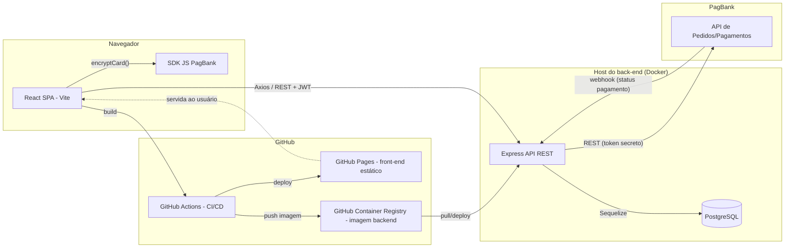
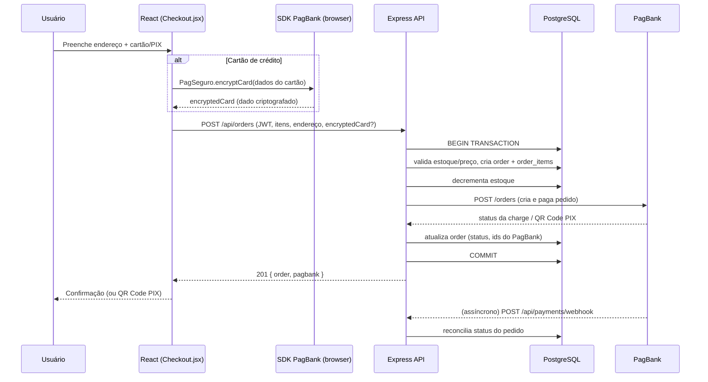

# Arquitetura — Hanami E-commerce

## 1. Raciocínio (Chain-of-Thought) do projeto

1. O site original (`index-----.html`, `style.css`, `script.js`) é 100% estático: dados mockados em `script.js`, filtro de categoria e carrinho vivendo apenas no DOM/memória.
2. Para virar um e-commerce real, era preciso separar em duas aplicações que se comunicam por HTTP: um **front-end React** (mesma UI, agora orientada a componentes e a dados vindos de API) e um **back-end Express** (fonte da verdade sobre produtos, pedidos, usuários e pagamentos).
3. O layout/design foi mantido: reaproveitamos `style.css` sem alterações estruturais e recriamos cada seção do HTML como componente React equivalente (Header, Categories, ProductGrid, CartDrawer etc.).
4. Persistência exige um banco relacional (pedidos têm relações claras: usuário → pedido → itens → produto), por isso PostgreSQL + Sequelize (ORM) em vez de um banco documento.
5. Pagamento e autenticação são os pontos de maior risco (dinheiro e dados pessoais), então receberam validação em duas camadas (cliente + servidor) e o cartão nunca trafega em texto puro pelo nosso back-end.

## 2. Diagrama de componentes

## 3. Fluxo de dados — Checkout (visão sequencial)

## 4. Mapa de dependências

- **Front-end**: React 18, React Router, Axios, Vite, SDK JS do PagBank (via `<script>` externo).
- **Back-end**: Node.js 20, Express, Sequelize, PostgreSQL (`pg`/`pg-hstore`), JWT (`jsonwebtoken`), `bcryptjs`, `express-validator`, `helmet`, `cors`, `express-rate-limit`, `axios` (para chamar o PagBank).
- **Infra**: Docker + docker-compose (dev/local/VPS), GitHub Actions (CI/CD), GitHub Pages (host do front-end), GitHub Container Registry (host da imagem do back-end).

## 5. Decisões de arquitetura (Tree-of-Thought)

### 5.1 Onde hospedar o back-end, já que GitHub Pages só serve arquivos estáticos?

| Alternativa | Prós | Contras |
|---|---|---|
| **A. Front-end no GitHub Pages + back-end em container Docker publicado no GHCR e executado em qualquer VPS/host que suporte Docker** (adotada) | Usa GitHub/Actions como pedido pelo cliente; GitHub Pages fica 100% dentro do escopo gratuito; back-end continua portátil (mesma imagem roda em qualquer lugar) | Exige um host (mesmo que gratuito, ex.: uma VM pequena) para rodar o container; não é "tudo dentro do GitHub" |
| **B. Migrar tudo para Vercel/Render (que suportam back-end)** | Deploy mais simples, sem gerenciar servidor | Contradiz a exigência explícita de usar GitHub Pages/Actions no lugar da AWS |
| **C. Reescrever o back-end como Serverless Functions do próprio GitHub (Actions on-demand)** | Ficaria "tudo no GitHub" | GitHub Actions não é um runtime de API HTTP contínuo — inviável para servir requisições em tempo real |

Escolhemos **A**: GitHub Actions builda e testa tudo, publica o front-end no GitHub Pages e publica a imagem Docker do back-end no GitHub Container Registry (também GitHub). Falta apenas apontar essa imagem para um host Docker (VPS próprio, por exemplo) — isso está documentado no `docker-compose.yml` e é o único passo que não pode ser 100% "GitHub", pois GitHub Pages é exclusivamente estático.

### 5.2 ORM/Banco: Sequelize + PostgreSQL vs. alternativas

| Alternativa | Prós | Contras |
|---|---|---|
| **A. Sequelize + PostgreSQL** (adotada — exigida pelo enunciado) | Relacional, transações ACID (essencial para não vender itens sem estoque), migrations versionadas, tipos fortes (ENUM, DECIMAL) | Um pouco mais verboso que ORMs "code-first" mais novos (Prisma) |
| **B. Prisma + PostgreSQL** | DX mais moderna, tipagem automática | Fora do stack pedido explicitamente |
| **C. MongoDB (Mongoose)** | Schema flexível | Pedidos/itens/produtos são fortemente relacionais; perderíamos JOINs e transações relacionais nativas |

### 5.3 Autenticação: JWT stateless vs. sessão em servidor

| Alternativa | Prós | Contras |
|---|---|---|
| **A. JWT em `Authorization: Bearer`** (adotada) | Sem estado no servidor (escala horizontalmente), simples de usar em SPA + API separada | Revogar um token antes de expirar exige lista de bloqueio (não implementado nesta versão) |
| **B. Sessão + cookie httpOnly no servidor** | Mais fácil de revogar imediatamente | Exige armazenamento de sessão compartilhado (Redis) se houver múltiplas réplicas do back-end |

### 5.4 Integração de pagamento: cartão tokenizado no navegador vs. enviar dados ao back-end

| Alternativa | Prós | Contras |
|---|---|---|
| **A. SDK do PagBank criptografa o cartão no navegador (`encryptCard`)** (adotada) | Reduz drasticamente o escopo PCI-DSS da aplicação — nosso back-end nunca vê o número do cartão | Depende de carregar o script do PagBank no front-end |
| **B. Back-end recebe número/CVV em texto puro e repassa ao PagBank** | Nenhuma dependência de SDK no front | Aumenta MUITO o escopo de conformidade PCI-DSS; não recomendado |

## 6. Ralph Loop — Autoavaliação crítica desta etapa

**O que funcionou bem:** a separação clara de camadas (rotas → validação → controller → model/serviço) deixa fácil localizar onde mexer; o uso de transação no `orderController.create` evita vender produto sem estoque; o design/CSS original foi 100% preservado.

**Riscos e limitações conhecidas:**
- O webhook do PagBank, por simplicidade didática, não valida assinatura/segredo do payload — em produção isso é obrigatório (`PAGBANK_WEBHOOK_SECRET` já está previsto no `.env.example`, mas a validação em si precisa ser implementada com o mecanismo que o PagBank disponibilizar para a sua conta).
- Não há fila (Redis/BullMQ) entre o webhook e o processamento — para alto volume, isso deveria ser assíncrono.
- `sequelize.sync({ alter: true })` só roda em desenvolvimento; produção deve usar migrations (`sequelize-cli`) — os models já estão prontos para gerar migrations automaticamente.
- Testes automatizados (Jest/Supertest) estão configurados no `package.json` e no workflow de CI, mas os arquivos de teste em si ficam como próximo passo recomendado (ver seção "Melhorias sugeridas" no README).

**Melhoria proposta para a próxima iteração:** adicionar um serviço de fila para processar webhooks e um endpoint `/api/orders/:id/pix-status` que faça *polling* leve enquanto o QR Code não expira, melhorando a UX de quem está esperando a confirmação do PIX.
